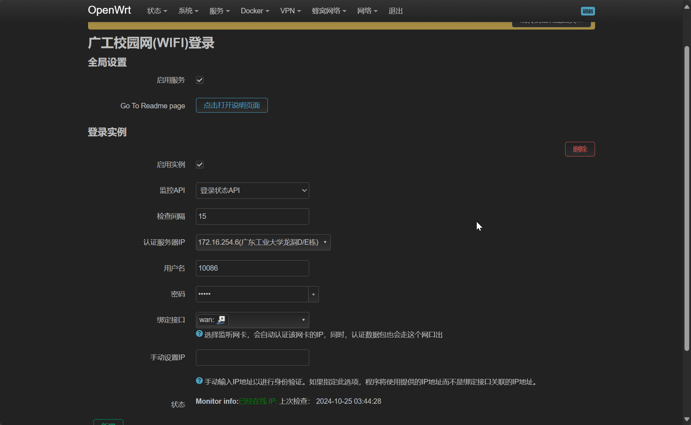

# GDUT LOGIN

## 项目介绍

GDUT LOGIN 是一款用于自动化登录广东工业大学（GDUT）校园网的工具。该插件旨在简化用户的网络认证过程，提供便捷的校园网络连接，帮助用户以更低的成本享受校园网络服务。

## 使用说明

1. **安装插件**：可以自己编译或从release下载，本插件使用脚本作为后端+lua前端，适配绝大部分架构，只需要有curl和jq软件包即可
2. **配置设置**：
   - 启用服务：在设置中勾选“Enable Service”以启用插件。
   - 登录实例：填写用户名、AC IP 和密码等信息。
   - 绑定接口：选择合适的网络接口进行认证。
3. **手动设置 IP**（可选）：如果需要，可以手动输入 IP 地址进行认证。
4. **检查间隔**：设置检查间隔时间，以便插件定期检查网络状态。

## 功能介绍

- **状态监控**：实时监控网络状态，确保用户始终在线。
- **多个接口支持**：支持多种网络接口的绑定，适应不同的网络环境。
- **手动 IP 设置**：允许用户手动设置 IP 地址，以便在特定情况下进行认证。
- **检查频率设置**：用户可以自定义检查网络状态的频率，优化网络连接体验。

通过 GDUT LOGIN，用户可以轻松连接校园网，享受稳定和高效的网络服务。
